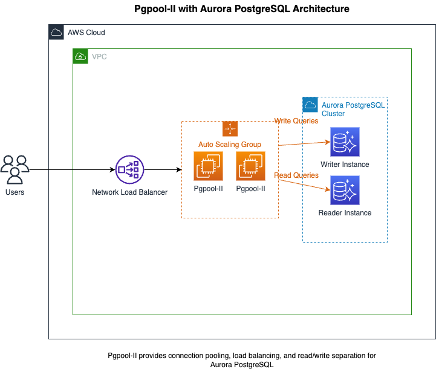

# Pgpool-II Aurora PostgreSQL Architecture

这个项目使用AWS CDK实现了一个高可用的Pgpool-II与Aurora PostgreSQL架构。该架构包括：

- Aurora PostgreSQL集群（1个写入节点，可配置数量的读取节点）
- 使用预先创建的AMI部署Pgpool-II的Auto Scaling Group
- 网络负载均衡器(NLB)，通过pgdoctor(8071端口)检查pgpool健康状态
- 适当的安全组配置和IAM角色

## 架构概述



该架构提供以下功能：
- 高可用性：通过在多个可用区部署Pgpool-II实例和Aurora节点
- 负载均衡：Pgpool-II提供连接池和负载均衡功能
- 自动扩展：根据负载自动调整Pgpool-II实例数量
- 健康检查：使用pgdoctor监控Pgpool-II实例健康状态

## 前提条件

1. 已创建包含pgpool和pgdoctor的AMI（使用`create_pgpool_AMI.py`脚本）
2. 安装了AWS CDK CLI
3. 配置了AWS凭证

## 获取和准备项目

### 1. 获取项目代码

如果您还没有获取项目代码，可以通过以下方式获取：

```bash
# 使用Git克隆
git clone https://github.com/yourusername/pgpool-cluster-auto.git
cd pgpool-cluster-auto/pgpool_aurora_cdk

# 或者，如果您已下载并解压ZIP文件
cd pgpool-cluster-auto-main/pgpool_aurora_cdk
```

### 2. 安装依赖

```bash
# 创建并激活虚拟环境
python -m venv .venv
source .venv/bin/activate

# 安装依赖
pip install -r requirements.txt

# 安装AWS CDK CLI（如果尚未安装）
npm install -g aws-cdk
```

### 3. 初始化CDK环境（首次使用）

首先，检查是否已在目标区域初始化CDK环境：

```bash
aws cloudformation describe-stacks --stack-name CDKToolkit
```

如果命令返回错误"Stack with id CDKToolkit does not exist"，则表示需要执行初始化。

如果是首次在AWS账户/区域使用CDK，需要执行bootstrap命令：

```bash
cdk bootstrap aws://ACCOUNT-NUMBER/REGION
```

替换`ACCOUNT-NUMBER`为您的AWS账户ID，`REGION`为您要部署的区域。

bootstrap过程会在您的账户中创建必要的资源，包括S3存储桶和IAM角色，以支持CDK部署。这是一次性操作，每个区域只需执行一次。

### 4. 配置参数

可以通过CDK上下文参数配置部署选项：

```bash
cdk deploy -c ami_id=ami-xxxxxxxxxx \
           -c vpc_id=vpc-xxxxxxxxxx \
           -c subnet_ids=subnet-xxxx,subnet-yyyy,subnet-zzzz \
           -c instance_type=t3.medium \
           -c disk_size=20 \
           -c min_capacity=2 \
           -c max_capacity=4 \
           -c desired_capacity=2 \
           -c db_instance_class=db.t3.medium \
           -c db_replica_count=1
```

### 5. 部署前验证

在执行部署前，可以使用以下命令查看将要创建的资源：

```bash
cdk diff -c ami_id=ami-xxxxxxxxxx [其他参数]
```

这将显示CloudFormation将要执行的变更，但不会实际部署资源。

### 参数说明

| 参数 | 描述 | 默认值 | 是否必需 |
|------|------|--------|----------|
| ami_id | Pgpool-II AMI ID | - | 是 |
| vpc_id | 现有VPC ID | - | 否，不提供将创建新VPC |
| subnet_ids | 子网ID列表，逗号分隔 | - | 否，不提供将使用VPC默认子网 |
| instance_type | Pgpool-II实例类型 | t3.medium | 否 |
| disk_size | Pgpool-II实例磁盘大小(GB) | 20 | 否 |
| min_capacity | Auto Scaling Group最小容量 | 2 | 否 |
| max_capacity | Auto Scaling Group最大容量 | 4 | 否 |
| desired_capacity | Auto Scaling Group期望容量 | 2 | 否 |
| db_instance_class | Aurora实例类型 | db.t3.medium | 否 |
| db_replica_count | Aurora只读副本数量 | 1 | 否 |

### 6. 执行部署

执行以下命令开始部署：

```bash
cdk deploy -c ami_id=ami-xxxxxxxxxx [其他参数]
```

部署过程中，CDK会显示将要创建的IAM权限，需要确认后继续。

### 7. 部署输出

部署成功后，CDK会输出重要的资源信息：

- **NLBEndpoint**: 网络负载均衡器端点，用于连接Pgpool
- **AuroraClusterEndpoint**: Aurora集群写入端点
- **AuroraReaderEndpoint**: Aurora集群读取端点
- **DatabaseSecretArn**: 数据库凭证密钥ARN

这些输出值可以在AWS控制台的CloudFormation服务中查看，或通过以下命令获取：

```bash
aws cloudformation describe-stacks --stack-name PgpoolAuroraStack --query "Stacks[0].Outputs"
```
